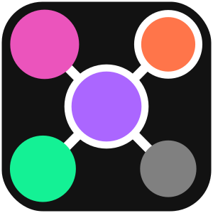

  

<h1 align="center">Solana Graph Wiki</h1>

  🧠 A collaborative knowledge base about Solana accounts, programs, and on-chain data structures.

  <a href="https://solanagraph.com">Solana Graph</a> • 
  <a href="https://wiki.solanagraph.com">Solana Graph Wiki</a> • 
  <a href="https://github.com/solanagraph">Feedback</a>

  
  
  

---

## 📘 About This Wiki

This repository contains the Markdown content powering [**Solana Graph Wiki**](https://wiki.solanagraph.com) — a knowledge base for the **Solana Graph** ecosystem.

[**Solana Graph**](https://solanagraph.com) is a tool for exploring the relationships between accounts, programs, and instructions on the Solana blockchain — presented as a visual, interactive graph.

This wiki helps users understand:

- 📁 Account data structures  
- ⚙️ On-chain programs and their instructions  
- 🧪 **Planned:** Usage guides & dev tools

## ✨ Goals

- Make Solana's low-level data more understandable  
- Help developers navigate on-chain structures  
- Enable better tooling, debugging, and learning

## 🧪 Project Status

This project is in **early-stage development** — documentation is actively being written and improved.

